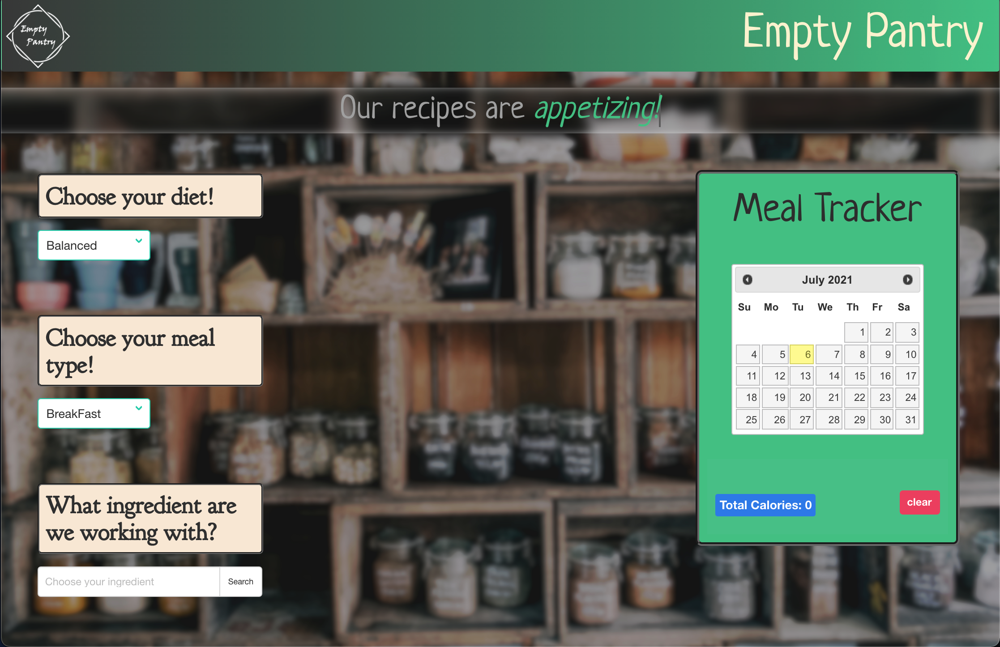

# Group-Project-Name: Empty Pantry

The website is built using tools like HTML/CSS, Bulma, Bootstrap, jQuery, and Javascript. The websites’ primary features include but are not limited to: meal search by category & by ingredient name, a dynamic meal planner with calendar and saved list, massive nutrition information modal and a simply calorie calculator.
